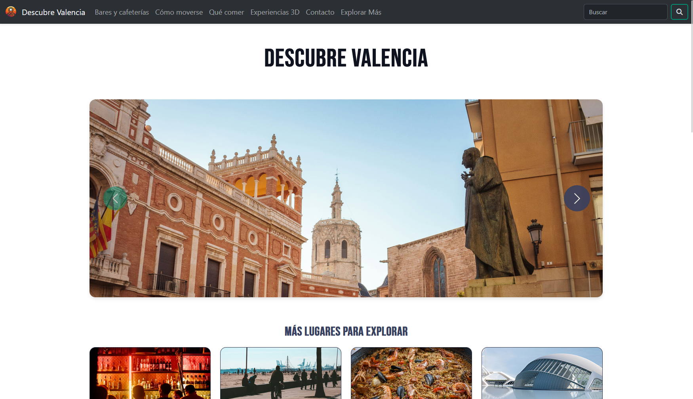
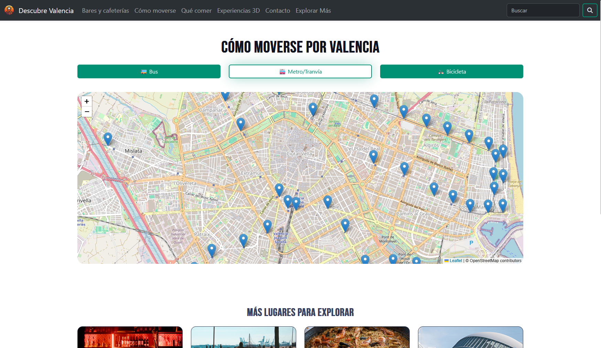
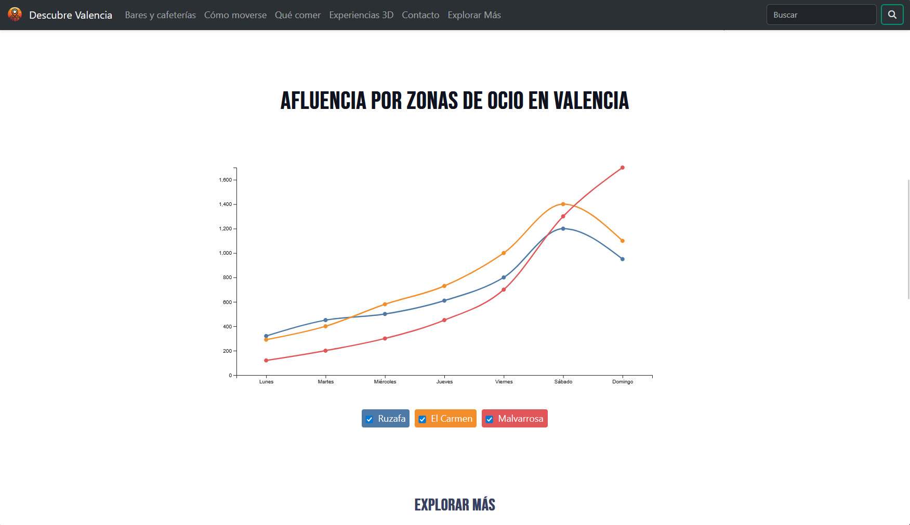

# Descubre Valencia - Web de Ocio Interactiva

## Descripción
**Descubre Valencia** es una página web con la temática de promoción al turismo y el ocio en la ciudad de Valencia. Este proyecto se centra en el Front-End, integrando tecnologías gráficas avanzadas para ofrecer experiencias interactivas, como un museo virtual en 3D y visualización de datos turísticos.

<p align="center">
  
  
  
</p>

El diseño es **Responsive**, adaptándose a dispositivos móviles gracias al uso del framework **Bootstrap**.

Este proyecto fue desarrollado para la asignatura de Programación Multimedia en la Universitat de València en 2024.

## Secciones y Funcionalidades

La web está estructurada en módulos temáticos:

### Ocio y Gastronomía
* **Bares y Cafeterías:** Una selección de los mejores lugares para disfrutar del ambiente valenciano.
* **Qué comer:** Guía visual de la gastronomía local.

### Utilidades
* **Cómo moverse:** Información práctica sobre transporte público y movilidad en la ciudad con un mapa interactivo.
* **Contacto:** Formulario de conexión para dudas o sugerencias.

### Experiencias Interactivas

1.  **Experiencias 3D (Museo Virtual):**
    * Implementado con **Three.js**.
    * Permite al usuario navegar por un entorno tridimensional e interactuar con modelos 3D relacionados con la cultura valenciana directamente desde el navegador.

2.  **Explorar Más:**
    * **Minijuego:** Desarrollado utilizando la **API Canvas** de HTML5 y JavaScript nativo.
    * **Gráficos:** Visualización de datos estadísticos sobre el turismo en la ciudad implementados con **D3.js**.

## Estructura del Proyecto
El código está organizado de manera modular:

```text
/
├── 3d/          # Modelos y texturas para el museo virtual
├── audio/       # Recursos sonoros para el juego y reproductor de música
├── css/         # Estilos personalizados y Bootstrap
├── data/        # Archivos JSON/CSV para las gráficas de D3.js
├── fonts/       # Tipografías locales
├── img/         # Imágenes estáticas de la web
├── js/          # Lógica del frontend
├── video/       # Clips de video promocionales
└── *.html       # Páginas principales
```
## Ejecución
Debido a las políticas de seguridad de los navegadores (CORS), las texturas 3D y los archivos de datos externos no cargarán si abres el `index.html` haciendo doble clic directamente.

Necesitas un servidor local. Tienes varias opciones sencillas:

### `Live Server` de VS Code

1. Instala VS Code
2. Instala la extensión `Live Server`.
3. Abre el proyecto en VS Code
4. Haz clic derecho en `index.html` y selecciona `Open with Live Server`.

### Python

Si tienes Python3, abre una terminal en la carpeta del proyecto y ejecuta:
```bash
python -m http.server 8000
```
Luego ve a `http://localhost:8000`.

### Node.js

Si tienes Node.js:

```bash
npx serve .
```